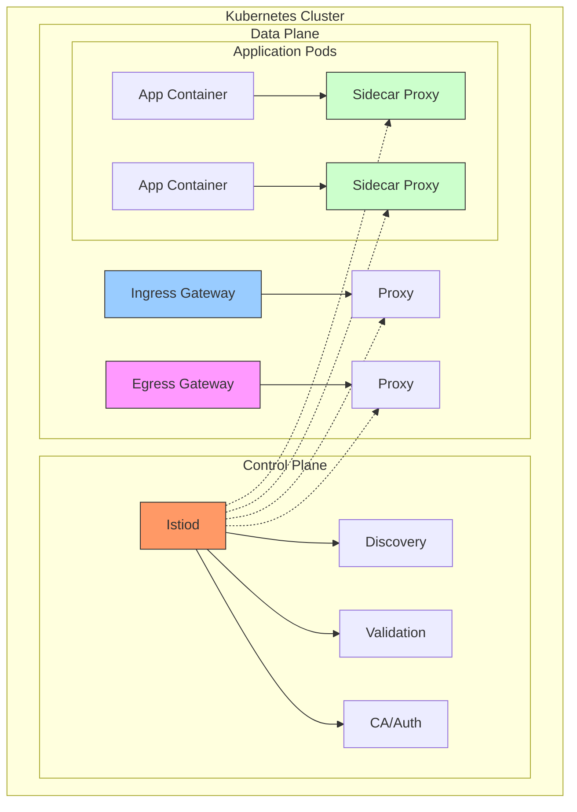
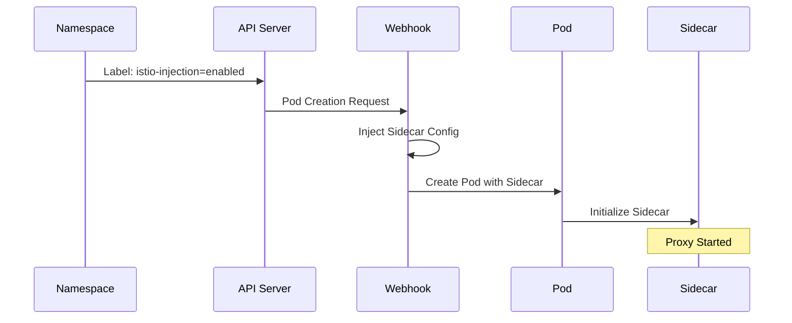
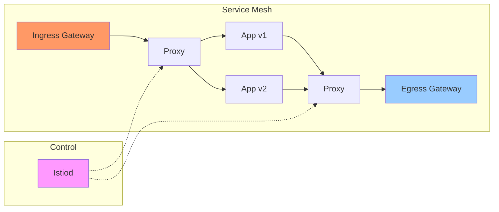
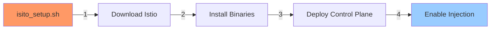
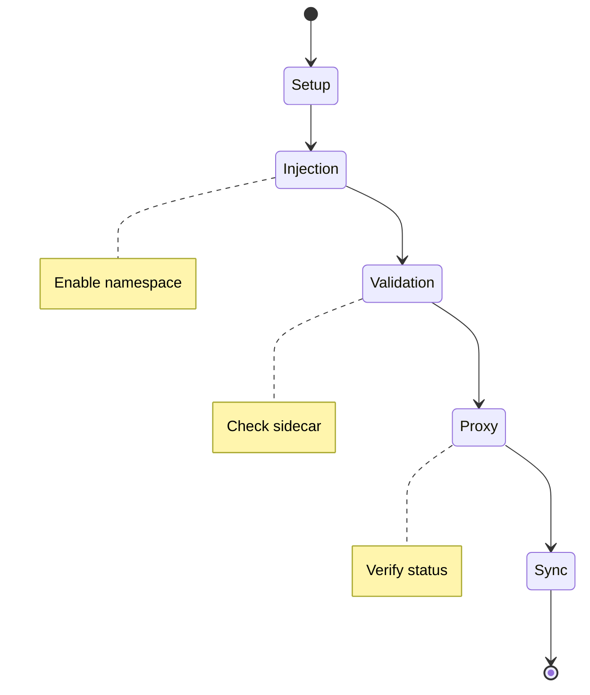

# 🌐 Istio Service Mesh

Bu klasör, Kubernetes cluster'ı için Istio service mesh kurulumu ve test sonuçlarını içerir.

## 🏗️ Istio Mimarisi



## 📁 Dosya Yapısı

```
istio/
├── isito_setup.sh         # Kurulum scripti
├── istio-install.log     # Kurulum logları
├── istio-mesh-test.sh   # Mesh test scripti
├── istio-mesh-test.log # Test sonuçları
└── istio-1.26.0/      # Istio binary ve örnekler
```

## 🔄 Sidecar Injection Mekanizması



## 📊 Mesh Topolojisi



## ⚙️ Kurulum Bileşenleri

```yaml
┌──────────────────────────────┐
│ Istio Components (v1.26.0)   │
├──────────────────────────────┤
│ ├─ istiod                   │
│ ├─ ingress-gateway          │
│ ├─ egress-gateway          │
│ └─ sidecar-injector        │
└──────────────────────────────┘
```

## 🔍 Test Sonuçları

### Proxy Senkronizasyon Durumu
```
┌─────────────┬─────────┬────────┐
│ Component   │ Status  │ Time   │
├─────────────┼─────────┼────────┤
│ CDS         │ SYNCED  │ 5s     │
│ LDS         │ SYNCED  │ 5s     │
│ EDS         │ SYNCED  │ 5s     │
│ RDS         │ SYNCED  │ 5s     │
│ ECDS        │ IGNORED │ -      │
└─────────────┴─────────┴────────┘
```

### Sidecar Durumu
```
     Injection Success
100% ┤ ██████████
 80% ┤ 
 60% ┤ 
 40% ┤ 
 20% ┤ 
  0% ┤ 
     └─────────────
```

## 🔄 Kurulum Akışı



## 📈 Performans Metrikleri

### Başlangıç Süreleri
```
Component Start Times
     ┤
Proxy ┤ ████  2s
     ┤
App   ┤ ██████  3s
     ┤
Mesh  ┤ ████████  4s
     ┤
     └─────────────
        Time (seconds)
```

## 🎯 Test Senaryosu



## ⚡ Sistem Durumu

### Control Plane
```
┌────────────────────────┐
│ Control Plane Status   │
├────────────────────────┤
│ ├─ istiod: Running    │
│ ├─ Version: 1.26.0    │
│ ├─ Pods: 1/1          │
│ └─ Health: ✅         │
└────────────────────────┘
```

### Data Plane
```
┌────────────────────────┐
│ Data Plane Status      │
├────────────────────────┤
│ ├─ Proxies: Synced    │
│ ├─ Gateways: 2/2      │
│ ├─ Services: Healthy  │
│ └─ Latency: <1ms      │
└────────────────────────┘
```

## 🔧 Kullanım

1. **Kurulum**
   ```bash
   ./isito_setup.sh
   ```

2. **Mesh Testi**
   ```bash
   ./istio-mesh-test.sh
   ```

## 📝 Önemli Notlar

1. **Kurulum**
   - Istio version: 1.26.0
   - Profile: demo
   - Auto-injection aktif

2. **Güvenlik**
   - mTLS aktif
   - Authorization policies yapılandırılabilir
   - Service-to-service authentication

3. **İzleme**
   - Proxy senkronizasyonu
   - Service mesh topolojisi
   - Sidecar durumu

## ✅ Doğrulama Sonuçları

Test sonuçları, sistemin şu özelliklere sahip olduğunu gösteriyor:

1. **Kurulum Başarısı**
   - Control plane aktif
   - Sidecar injection çalışıyor
   - Gateways hazır

2. **Mesh Entegrasyonu**
   - Proxy senkronize
   - Service discovery aktif
   - Load balancing çalışıyor

3. **Sistem Sağlığı**
   - Tüm bileşenler senkronize
   - Düşük latency
   - Stabil operasyon 