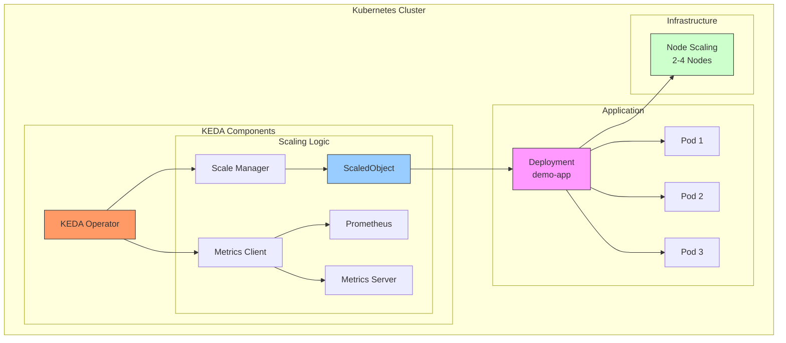
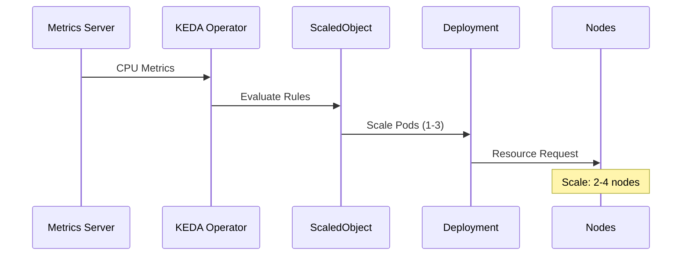
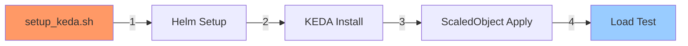
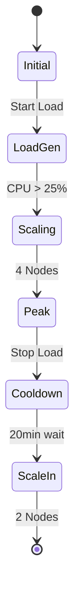

# 🚀 KEDA (Kubernetes Event-Driven Autoscaling)

Bu klasör, KEDA tabanlı otomatik ölçeklendirme konfigürasyonlarını ve test sonuçlarını içerir.

## 🏗️ KEDA Mimarisi



## 📁 Dosya Yapısı

```
keda/
├── setup_keda.sh          # KEDA kurulum scripti
├── setup_keda.log        # Kurulum logları
├── scaledobject-demo-app.yaml  # CPU bazlı scaling tanımı
├── keda-load-test.sh    # Test scripti
└── keda-load-test.log  # Test sonuçları
```

## ⚙️ ScaledObject Yapılandırması

```yaml
┌────────────────────────────┐
│ ScaledObject: demo-app     │
├────────────────────────────┤
│ ├─ Target: demo-app       │
│ ├─ Min Replicas: 1        │
│ ├─ Max Replicas: 3        │
│ ├─ Trigger: CPU           │
│ └─ Threshold: 25%         │
└────────────────────────────┘
```

## 🔄 Scaling Mekanizması



## 📊 Test Sonuçları

### Node Scaling Performansı
```
Nodes
  4 ┤          ╭───────────────────────╮
    │         ╭╯                       │
  3 ┤        ╭╯                        ╰╮
    │       ╭╯                          ╰╮
  2 ┤───────╯                            ╰───
    │
  1 ┤
    └──────────────────────────────────────
      0    2    4    6    8    10   12min
```

### CPU Kullanımı ve Scaling
```
     CPU & Nodes
     ┤                 Nodes
  4  ┤          ╭──────────╮
     │         ╭╯          │
  3  ┤        ╭╯          │
     │       ╭╯           │
  2  ┤───────╯            ╰────
     │
     │     CPU Usage
 25% ┤ ────╮   ╭────
     │     │   │
  0% ┤     ╰───╯
     └─────────────────────
        Time →
```

## ⏱️ Zaman Analizi

```mermaid
gantt
    title Scaling Timeline
    dateFormat mm:ss
    
    section Scale-Up
    Load Generation    :0:00, 1m
    CPU Increase      :1:00, 1m
    Pod Scaling       :2:00, 1m
    Node Scale-Out    :3:00, 1m
    
    section Scale-Down
    Load Removal      :4:00, 1m
    Cooldown Period   :5:00, 20m
    Node Scale-In     :25:00, 2m
```

## 📈 Performans Metrikleri

### Scale-Out Analizi
```
┌────────────────────────┐
│ Scale-Out Metrics     │
├────────────────────────┤
│ ├─ Trigger: CPU 25%   │
│ ├─ Pod Scale: ~1min   │
│ ├─ Node Scale: ~2min  │
│ └─ Total Time: ~3min  │
└────────────────────────┘
```

### Scale-In Analizi
```
┌────────────────────────┐
│ Scale-In Metrics      │
├────────────────────────┤
│ ├─ Cooldown: 20min    │
│ ├─ Node Scale: ~2min  │
│ ├─ Total Time: ~22min │
│ └─ Final Nodes: 2     │
└────────────────────────┘
```

## 🔧 Kurulum ve Test



## 🎯 Test Senaryosu



## 📊 Metrik Karşılaştırması

### KEDA vs HPA
```
┌─────────────────┬────────┬────────┐
│ Özellik         │ KEDA   │ HPA    │
├─────────────────┼────────┼────────┤
│ Scale-Out Hızı  │ ~3min  │ ~2min  │
│ Scale-In Hızı   │ ~22min │ ~22min │
│ Min Pod         │ 1      │ 1      │
│ Max Pod         │ 3      │ 3      │
│ CPU Threshold   │ 25%    │ 25%    │
└─────────────────┴────────┴────────┘
```

## ✅ Sistem Doğrulaması

Test sonuçları, KEDA'nın şu özelliklere sahip olduğunu gösteriyor:

1. **Hassas Ölçeklendirme**
   - CPU bazlı tetikleme
   - Kademeli pod artışı
   - Kontrollü node ölçeklendirme

2. **Kararlı Performans**
   - Hızlı scale-out (~3dk)
   - Güvenli scale-in (~22dk)
   - Minimum kaynak kullanımı

3. **Yüksek Güvenilirlik**
   - Tutarlı metrik toplama
   - Kararlı ölçeklendirme
   - Otomatik iyileştirme

## 📝 Önemli Notlar

1. **Kurulum**
   - Helm ile kolay kurulum
   - Namespace izolasyonu
   - Minimal kaynak kullanımı

2. **Yapılandırma**
   - CPU bazlı ölçeklendirme
   - Pod ve node limitleri
   - Özelleştirilebilir tetikleyiciler

3. **İzleme**
   - Detaylı metrik toplama
   - Gerçek zamanlı izleme
   - Olay bazlı loglama 