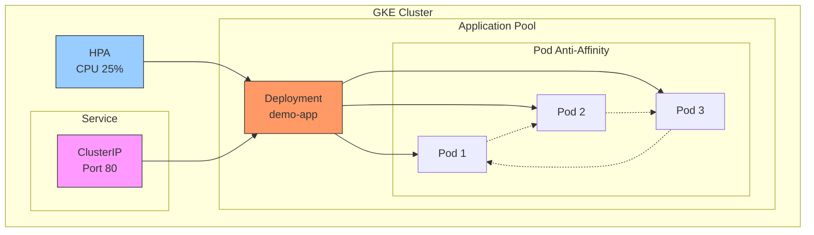
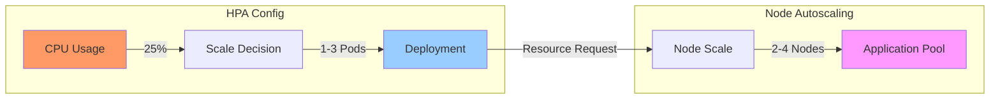
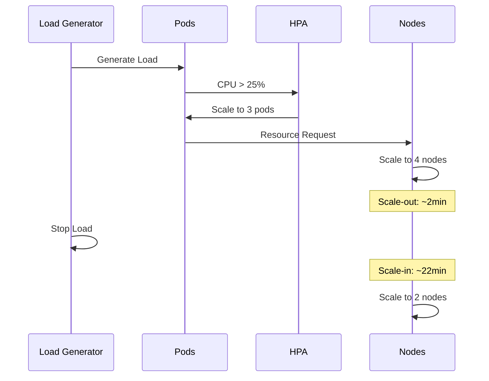

# 🚀 Kubernetes Uygulama Deployment ve Test

Bu klasör, örnek uygulamanın Kubernetes üzerinde deployment, autoscaling ve test süreçlerini içerir.

## 🏗️ Sistem Mimarisi



## 📁 Dosya Yapısı

```
kubernates/
├── deployment.yaml     # Pod yapılandırması
├── service.yaml       # Service tanımı
├── hpa.yaml          # Autoscaling kuralları
├── apply.sh          # Uygulama scripti
├── test.sh          # Test scripti
└── load.sh         # Yük oluşturma scripti
```

## ⚙️ Deployment Özellikleri

```yaml
┌──────────────────────────────┐
│ Deployment: demo-app         │
├──────────────────────────────┤
│ ├─ Node Pool: application    │
│ ├─ Anti-Affinity: Enabled   │
│ ├─ Image: nginx             │
│ ├─ CPU Request: 100m        │
│ └─ Memory Request: 128Mi    │
└──────────────────────────────┘
```

## 🔄 Autoscaling Yapılandırması



## 📊 Test Sonuçları

### Scale-Up Süreci
```
Nodes
  4 ┤           ╭──────────────────
    │          ╭╯
  3 ┤         ╭╯
    │        ╭╯
  2 ┤────────╯
    │
  1 ┤
    └─────────────────────────────
      0   1   2   3   4   5   6min
```

### Scale-Down Süreci
```
Nodes
  4 ┤────────────────────────╮
    │                        │
  3 ┤                        │
    │                        │
  2 ┤                        ╰────
    │
  1 ┤
    └─────────────────────────────
      0    5    10    15    20min
```

## 🔬 Test Analizi



## ⏱️ Zaman Analizi

```mermaid
gantt
    title Scaling Timeline
    dateFormat mm:ss
    
    section Scale-Up
    Load Başlangıç      :0:00, 1m
    Pod Scale           :1:00, 1m
    Node Scale          :2:00, 1m
    
    section Scale-Down
    Yük Kaldırma       :3:00, 1m
    Cooldown Period    :4:00, 15m
    Node Reduction     :19:00, 3m
```

## 📈 Resource Kullanımı

### CPU Profili
```
     CPU Usage
100% ┤
     │    Scale-Out Trigger
 75% ┤     ╭──╮
     │     │  │
 50% ┤     │  │
     │     │  │
 25% ┤ ────╯  ╰────
     │
  0% ┤
     └─────────────────
        Time →
```

## 🎯 Test Sonuç Özeti

```
┌────────────────────────────┐
│ Test Metrikleri           │
├────────────────────────────┤
│ ├─ Başlangıç Node: 2      │
│ ├─ Maximum Node: 4        │
│ ├─ Scale-Out: ~2 dakika   │
│ ├─ Scale-In: ~22 dakika   │
│ └─ Test Süresi: ~24 dakika│
└────────────────────────────┘
```

## 🔧 Kullanım

1. **Deployment Uygulama**
   ```bash
   ./apply.sh
   ```

2. **Test Başlatma**
   ```bash
   ./test.sh
   ```

3. **Manuel Yük Oluşturma**
   ```bash
   ./load.sh
   ```

## 📝 Önemli Notlar

1. **Anti-Affinity**
   - Pod'lar farklı node'lara dağıtılır
   - Yüksek erişilebilirlik sağlanır

2. **Resource Yönetimi**
   - CPU: request=100m, limit=200m
   - Memory: request=128Mi, limit=256Mi

3. **Scaling Politikası**
   - Pod: min=1, max=3
   - Node: min=2, max=4
   - CPU hedefi: %25

## ✅ Sistem Doğrulaması

Test sonuçları, sistemin şu özelliklere sahip olduğunu gösteriyor:

1. **Ölçeklenebilirlik**
   - Pod'lar CPU kullanımına göre ölçeklenir
   - Node'lar resource taleplerine göre ölçeklenir

2. **Kararlılık**
   - Scale-out hızlı (~2dk)
   - Scale-in kontrollü (~22dk)

3. **Güvenilirlik**
   - Anti-affinity ile yüksek erişilebilirlik
   - Resource limitleri ile kaynak kontrolü 