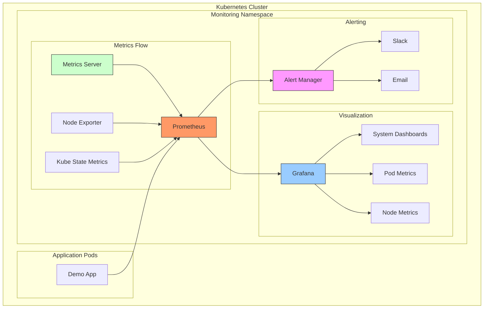
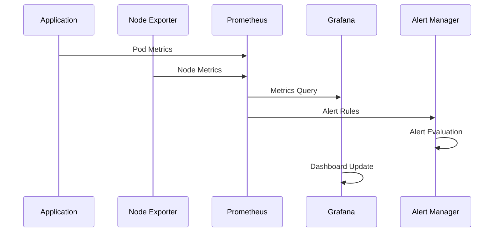
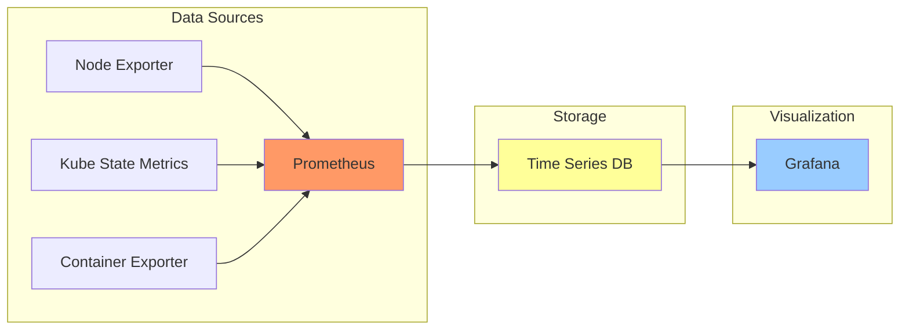
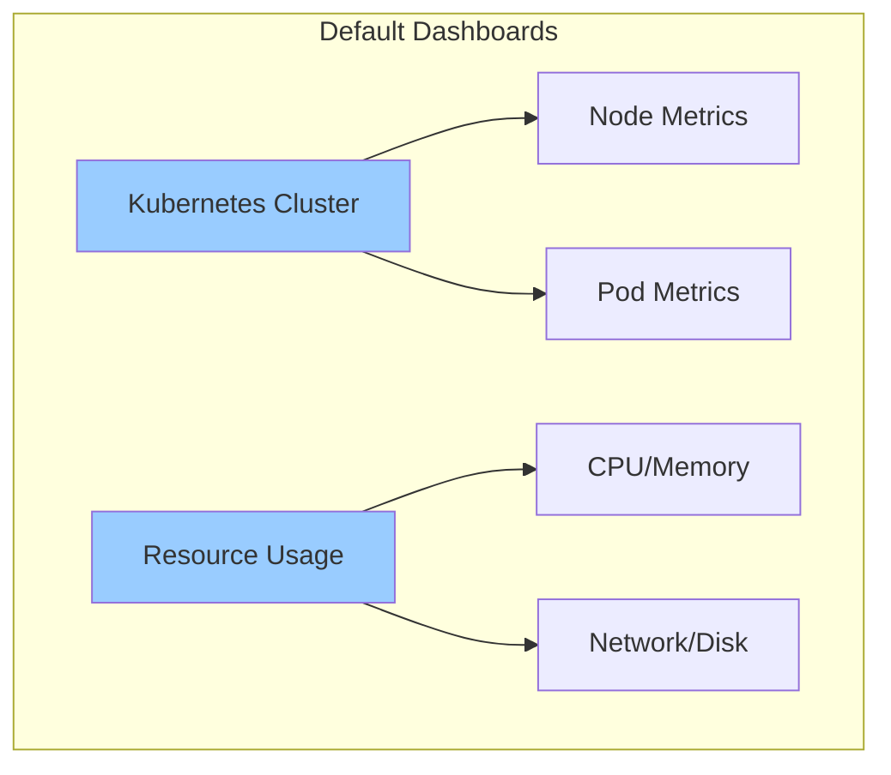
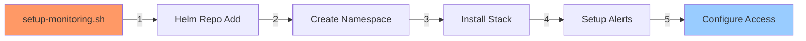
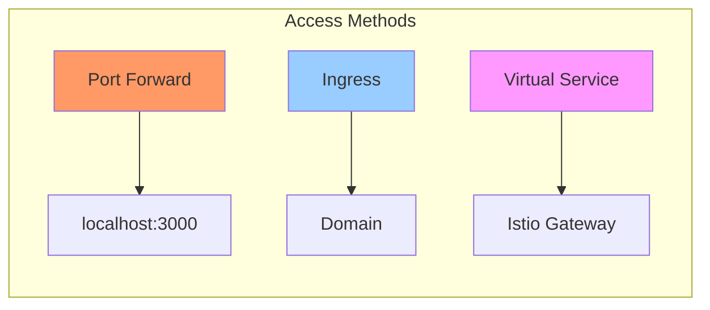

# 📊 Kubernetes Monitoring Stack

Bu klasör, Kubernetes cluster'ı için Prometheus ve Grafana tabanlı monitoring stack'ini içerir.

## 🏗️ Monitoring Mimarisi



## 📁 Dosya Yapısı

```
monitoring/
├── setup-monitoring.sh       # Ana kurulum scripti
├── pod-restart-alert.yaml   # Pod restart alert kuralı
├── grafana-gateway.yaml     # Grafana gateway tanımı
├── expose-grafana.sh        # Grafana expose scripti
└── setup.log               # Kurulum logları
```

## 🔄 Metrics Akışı



## 📈 Metrik Toplama



## ⚙️ Kurulum Bileşenleri

```
┌──────────────────────────────┐
│ Kube Prometheus Stack        │
├──────────────────────────────┤
│ ├─ Prometheus               │
│ ├─ Grafana                  │
│ ├─ Alert Manager            │
│ ├─ Node Exporter            │
│ └─ Kube State Metrics       │
└──────────────────────────────┘
```

## 🎯 Alert Kuralları

### Pod Restart Alert
```yaml
┌─────────────────────────────┐
│ Alert: PodRestarted         │
├─────────────────────────────┤
│ Condition: >2 restarts/5min │
│ Severity: Warning           │
│ Namespace: default          │
│ Target: demo-app pods       │
└─────────────────────────────┘
```

## 🔍 Grafana Dashboards



## 📊 Metrik Örnekleri

### CPU Kullanımı
```
     CPU Usage
100% ┤
     │     Warning
 75% ┤     ╭──╮
     │     │  │
 50% ┤ ────╯  ╰────
     │
 25% ┤
     │
  0% ┤
     └─────────────────
        Time →
```

### Memory Kullanımı
```
     Memory Usage
8GB  ┤     ╭────╮
     │     │    │
6GB  ┤ ────╯    ╰──
     │
4GB  ┤
     │
2GB  ┤
     └─────────────────
        Time →
```

## 🔧 Kurulum Adımları



## 🔐 Erişim Yapılandırması



## ⚡ Performans Metrikleri

### Prometheus
```
┌────────────────────┐
│ Retention: 15d     │
│ Scrape Interval: 1m│
│ Evaluation: 1m     │
└────────────────────┘
```

### Grafana
```
┌────────────────────┐
│ Refresh: 5s        │
│ Retention: 30d     │
│ Data Source: Prom  │
└────────────────────┘
```

## 📝 Önemli Komutlar

```bash
# Stack Durumu
kubectl -n monitoring get pods

# Grafana Şifresi
kubectl get secret kps-grafana \
  -n monitoring \
  -o jsonpath="{.data.admin-password}" \
  | base64 -d

# Port Forward
kubectl port-forward svc/kps-grafana \
  -n monitoring 3000:80
```
