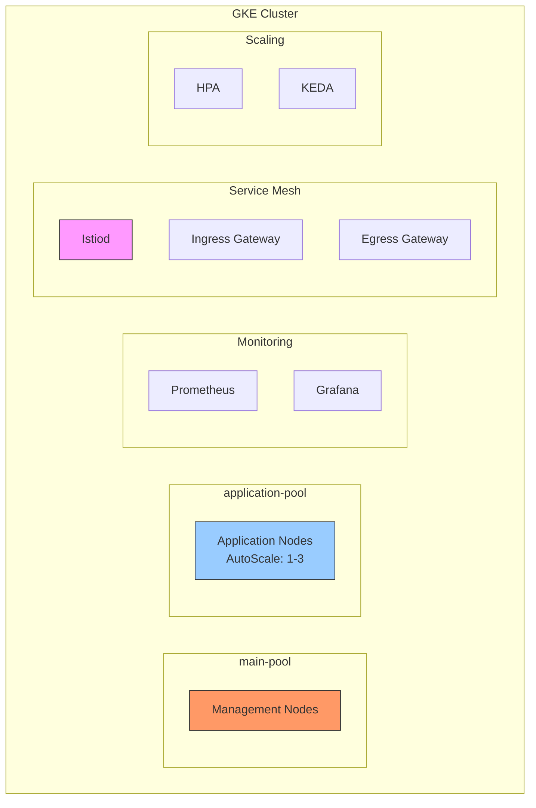

# 🚀 Wingie-Enuygun GKE Infrastructure Project

Bu proje, Google Kubernetes Engine (GKE) üzerinde modern bir Kubernetes altyapısı kurulumunu ve yönetimini içerir.

## 📁 Proje Yapısı

```
./
├── Dockerfile              # Geliştirme ortamı container yapılandırması
├── docker-compose.yml      # Container orchestration
├── workspace/
│   ├── terraform/         # GKE cluster ve node pool yapılandırmaları
│   ├── kubernetes/        # Kubernetes manifest dosyaları
│   ├── keda/             # KEDA autoscaling yapılandırmaları
│   ├── istio/            # Service mesh yapılandırmaları
│   ├── monitoring/       # Prometheus & Grafana kurulumları
│   ├── install_packages.sh # Gerekli paketlerin kurulum scripti
│   └── gcloud_container.sh # GKE cluster bağlantı scripti
```

## 🛠️ Geliştirme Ortamı

Proje, Docker container içinde çalışacak şekilde yapılandırılmıştır:

```yaml
# Dockerfile özellikleri:
- Ubuntu 22.04 base image
- Terraform v1.7.5
- Google Cloud SDK
- kubectl v1.30.1
- Helm
- Diğer gerekli araçlar
```

## 🎯 Proje Gereksinimleri ve Implementasyon

### 1. GKE Cluster Kurulumu
- ✅ Region: europe-west-1
- ✅ Logging ve monitoring disabled
- ✅ Terraform ile otomatik provisioning
- 📝 [Terraform Detayları](./workspace/terraform/README.md)

### 2. Node Pool Yapılandırması
- **main-pool:**
  - ✅ n2d makina tipi
  - ✅ Auto-scaling devre dışı
  - ✅ Sabit node sayısı
  
- **application-pool:**
  - ✅ n2d makina tipi
  - ✅ Auto-scaling: 1-3 node
  - ✅ Dinamik ölçeklendirme
  - 📝 [Node Pool Detayları](./workspace/terraform/README.md#node-pools)

### 3. Örnek Uygulama Deployment
- ✅ YAML manifest ile deployment
- ✅ Node affinity ile application-pool'a yönlendirme
- ✅ Service ve deployment yapılandırmaları
- 📝 [Kubernetes Manifest Detayları](./workspace/kubernetes/README.md)

### 4. HPA (Horizontal Pod Autoscaling)
- ✅ CPU threshold: 25%
- ✅ Scale range: 1-3 pods
- ✅ Metrics API entegrasyonu
- 📝 [HPA Yapılandırması](./workspace/kubernetes/README.md#hpa)

### 5. Monitoring Stack
- ✅ Prometheus kurulumu
- ✅ Grafana entegrasyonu
- ✅ Kubernetes metrics pipeline
- 📝 [Monitoring Detayları](./workspace/monitoring/README.md)

### 6. Grafana Alerting
- ✅ Pod restart alarmı
- ✅ Alert rules yapılandırması
- ✅ Notification channels
- 📝 [Grafana Alert Detayları](./workspace/monitoring/README.md#alerting)

### 7. KEDA Implementation
- ✅ KEDA kurulumu
- ✅ ScaledObject yapılandırması
- ✅ CPU-based scaling (HPA alternatifi)
- 📝 [KEDA Detayları](./workspace/keda/README.md)

### 8. Istio Service Mesh
- ✅ istiod (control plane)
- ✅ istio-ingress gateway
- ✅ istio-egress gateway
- ✅ Sidecar injection
- 📝 [Istio Detayları](./workspace/istio/README.md)

## 🚀 Başlangıç

1. **Repository Clone ve Git Kurulumu**
   ```bash
   # Yeni bir repository oluşturma
   git init
   
   # Tüm dosyaları staging'e ekleme
   git add .
   
   # İlk commit
   git commit -m "Initial commit: Project structure and documentation"
   
   # Remote repository ekleme
   git remote add origin https://github.com/alicancagdas/wingie-enuygun.git
   
   # Main branch'i oluşturma ve push
   git branch -M main
   git push -u origin main
   ```

2. **Geliştirme Ortamı Kurulumu**
   ```bash
   docker-compose up -d
   docker exec -it wingie-enuygun bash
   ```

3. **GCP Kimlik Doğrulama**
   ```bash
   ./workspace/gcloud_container.sh
   ```

4. **Altyapı Kurulumu**
   ```bash
   cd workspace/terraform
   terraform init
   terraform apply
   ```

## 📊 Sistem Mimarisi



## ✅ Gereksinim Karşılama Durumu

| Gereksinim | Durum | Detay |
|------------|-------|--------|
| GKE Cluster | ✅ | europe-west-1, logging/monitoring disabled |
| Node Pools | ✅ | main-pool (fixed), application-pool (autoscale) |
| Application Deployment | ✅ | Node affinity ile pool seçimi |
| HPA | ✅ | CPU 25%, 1-3 pods |
| Monitoring | ✅ | Prometheus + Grafana |
| Alerting | ✅ | Pod restart alarmı |
| KEDA | ✅ | CPU-based scaling alternatifi |
| Istio | ✅ | Full service mesh stack |

## 📝 Notlar

- Tüm kurulum ve yapılandırma adımları otomatize edilmiştir
- Infrastructure as Code (IaC) prensipleri uygulanmıştır
- Monitoring ve scaling çözümleri yedekli çalışmaktadır
- Service mesh ile gelişmiş trafik yönetimi sağlanmıştır

## 🔗 Faydalı Linkler

- [Terraform Dökümantasyonu](./workspace/terraform/README.md)
- [Kubernetes Manifest Detayları](./workspace/kubernetes/README.md)
- [KEDA Yapılandırması](./workspace/keda/README.md)
- [Istio Service Mesh](./workspace/istio/README.md)
- [Monitoring Stack](./workspace/monitoring/README.md)
