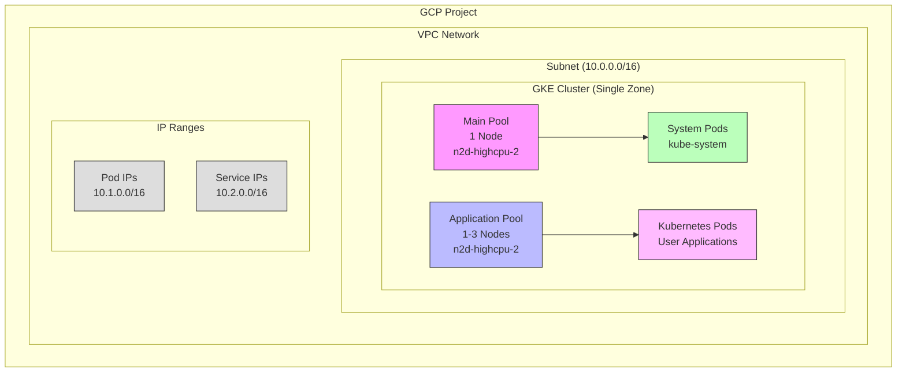
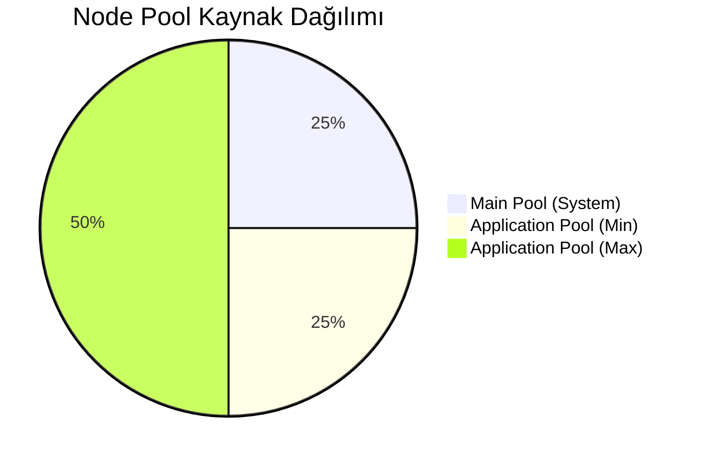
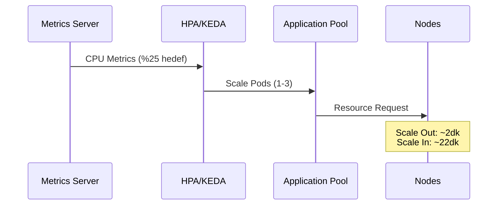
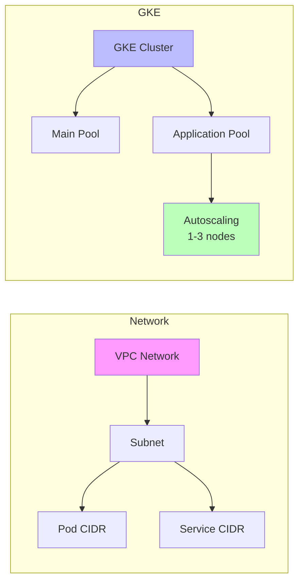
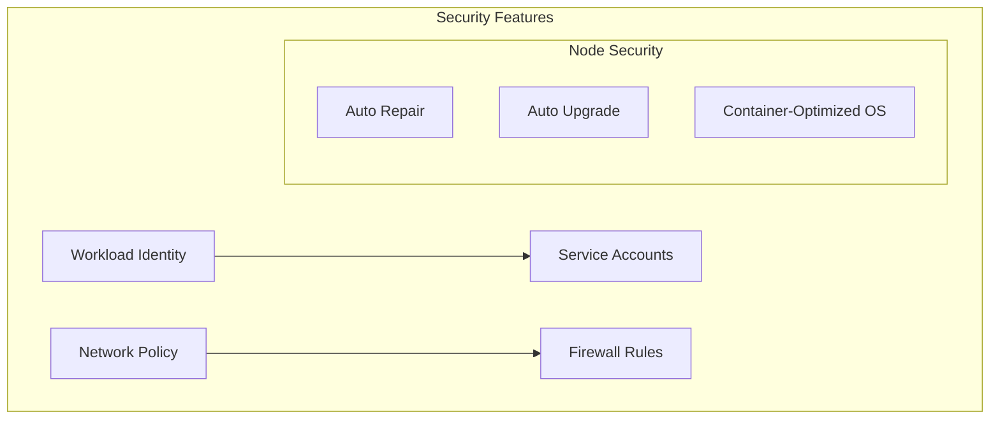
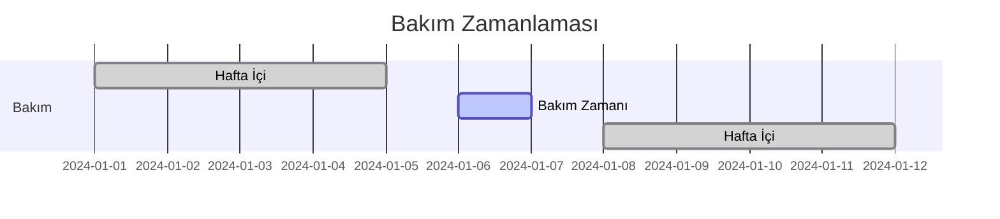
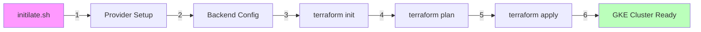

# GKE Cluster Terraform Konfigürasyonu

Bu klasör, Google Kubernetes Engine (GKE) cluster'ı ve ilgili altyapı bileşenlerini oluşturmak için Terraform konfigürasyonlarını içerir.

## 🏗️ Altyapı Mimarisi



## 📊 Resource Dağılımı



## 🔄 Autoscaling Akışı



## 📁 Terraform Kaynak Yapısı



## ⚙️ Resource Özellikleri

### Node Özellikleri
```
┌──────────────────────────────────┐
│ n2d-highcpu-2                    │
├──────────────────────────────────┤
│ ├─ vCPU: 2                       │
│ ├─ Memory: 8GB                   │
│ ├─ Disk: 100GB                   │
│ └─ OS: Container-Optimized OS    │
└──────────────────────────────────┘
```

### Network Yapılandırması
```
┌─────────────────────────────────────┐
│ Network Segmentation                │
├─────────────────────────────────────┤
│ ├─ VPC: Custom Network             │
│ ├─ Subnet: 10.0.0.0/16 (Primary)   │
│ ├─ Pods: 10.1.0.0/16 (Secondary)   │
│ └─ Services: 10.2.0.0/16 (Secondary)│
└─────────────────────────────────────┘
```

## 🔐 Güvenlik Yapılandırması



## 📈 Performans Metrikleri

### CPU Kullanımı ve Scaling
```
     CPU Utilization
100% ┤
     │     Scaling Trigger
 75% ┤        ╭──╮
     │        │  │
 50% ┤     ╭──╯  ╰──╮
     │     │        │
 25% ┤ ────╯        ╰────
     │
  0% ┤
     └─────────────────────
        Time →
```

### Node Scaling Timeline
```
Nodes
  4 ┤           ╭─────╮
    │           │     │
  3 ┤           │     │
    │           │     │
  2 ┤ ──────────╯     ╰──────
    │
  1 ┤
    └─────────────────────────
      Time →
      ← 2min → ← 22min →
```

## 🎯 Resource Limitleri

### Application Pool
```
┌────────────────────┐
│ Autoscaling Limits │
├────────────────────┤
│ Min Nodes: 1       │
│ Max Nodes: 3       │
│ Min Pods: 1        │
│ Max Pods: 3        │
│ CPU Target: 25%    │
└────────────────────┘
```

### Pod Resources
```
┌──────────────────────┐
│ Container Limits     │
├──────────────────────┤
│ CPU Request: 100m    │
│ CPU Limit: 200m      │
│ Memory Request: 128Mi│
│ Memory Limit: 256Mi  │
└──────────────────────┘
```

## ⏰ Bakım Penceresi



## 🔧 Kurulum Akışı



## 📁 Temel Konfigürasyon Dosyaları

### main.tf
Ana konfigürasyon dosyası, aşağıdaki kaynakları oluşturur:

1. **VPC Network**
   ```hcl
   resource "google_compute_network" "vpc"
   ```
   - Özel VPC ağı
   - Auto-create subnetworks devre dışı
   - Cluster adına göre otomatik isimlendirme

2. **Subnet**
   ```hcl
   resource "google_compute_subnetwork" "subnet"
   ```
   - IP aralığı: `10.0.0.0/16`
   - Pod IP aralığı: `10.1.0.0/16`
   - Servis IP aralığı: `10.2.0.0/16`

3. **GKE Cluster**
   ```hcl
   resource "google_container_cluster" "gke_cluster"
   ```
   - Tek zone'da çalışır
   - Logging ve monitoring devre dışı
   - Workload identity aktif
   - Network policy aktif
   - Bakım penceresi: Hafta sonları

4. **Node Pools**
   
   a. **Main Pool** (Sistem node'ları)
   ```hcl
   resource "google_container_node_pool" "main_pool"
   ```
   - Machine type: `n2d-highcpu-2`
   - Sabit 1 node
   - Autoscaling yok
   
   b. **Application Pool** (Uygulama node'ları)
   ```hcl
   resource "google_container_node_pool" "application_pool"
   ```
   - Machine type: `n2d-highcpu-2`
   - Min: 1 node, Max: 3 node
   - Autoscaling aktif

### variables.tf
Değişken tanımlamaları ve provider gereksinimleri:

```hcl
terraform {
  required_version = ">= 1.7.0"
  required_providers {
    google = "~> 6.36"
  }
}
```

**Temel Değişkenler:**
- `project_id`: GCP Proje ID'si
- `region`: VPC/Subnet bölgesi (default: europe-west1)
- `zone`: GKE cluster zone'u (default: europe-west1-b)
- `cluster_name`: Cluster adı (default: gke-cluster-demo)

### outputs.tf
Oluşturulan kaynakların çıktıları:

```hcl
output "network_name" { ... }    # VPC adı
output "subnet_name" { ... }     # Subnet adı
output "cluster_name" { ... }    # GKE cluster adı
output "main_node_pool" { ... }  # Main pool adı
output "app_node_pool" { ... }   # Application pool adı
```

### terraform.tfvars
Değişken değerlerinin tanımlandığı dosya:
```hcl
project_id = "fiery-iridium-460518-m8"
# Opsiyonel override'lar:
# zone = "europe-west1-c"
# region = "europe-west1"
# cluster_name = "my-cluster"
```

## 🚀 Autoscaling Yapılandırması

### Node-level Autoscaling
Application Pool'da aktif:
- Minimum: 1 node
- Maximum: 3 node
- Trigger: Pod resource talepleri
- Scale-out süresi: ~2 dakika
- Scale-in süresi: ~22 dakika

### Pod-level Autoscaling
KEDA veya HPA ile yönetilir:
- CPU bazlı ölçeklendirme
- Minimum: 1 pod
- Maximum: 3 pod
- CPU hedefi: %25 kullanım

## 🔧 Kurulum ve Kullanım

1. **Terraform Başlatma**
   ```bash
   ./initilate.sh
   ```
   - Provider plugin'lerini indirir
   - Backend'i yapılandırır
   - Workspace'i hazırlar

2. **Plan Oluşturma**
   ```bash
   terraform plan -out tfplan
   ```

3. **Altyapı Kurulumu**
   ```bash
   terraform apply tfplan
   ```

## 🏗️ Altyapı Mimarisi

```
                           GKE Cluster (Single Zone)
                                    │
                    ┌───────────────┴───────────────┐
                    │                               │
              Main Pool (1)                 Application Pool (1-3)
                    │                               │
             System Pods                     Application Pods
```

## ⚙️ Resource Özellikleri

### Node Özellikleri
- **CPU**: 2 vCPU (n2d-highcpu-2)
- **Memory**: 8GB
- **Disk**: 100GB
- **OS**: Container-Optimized OS

### Network Özellikleri
- **VPC Mode**: Custom
- **Pod CIDR**: /16 (65,536 IP)
- **Service CIDR**: /16 (65,536 IP)
- **Subnet CIDR**: /16 (65,536 IP)

## 📝 Önemli Notlar

1. **Maliyet Optimizasyonu**
   - Logging/monitoring devre dışı
   - Minimum node sayısı 2 (1 system + 1 application)
   - Spot instance kullanılmıyor

2. **Güvenlik**
   - Network policy aktif
   - Workload identity aktif
   - Private cluster değil

3. **Bakım**
   - Otomatik bakım: Hafta sonları
   - Node auto-repair: Aktif
   - Node auto-upgrade: Aktif 